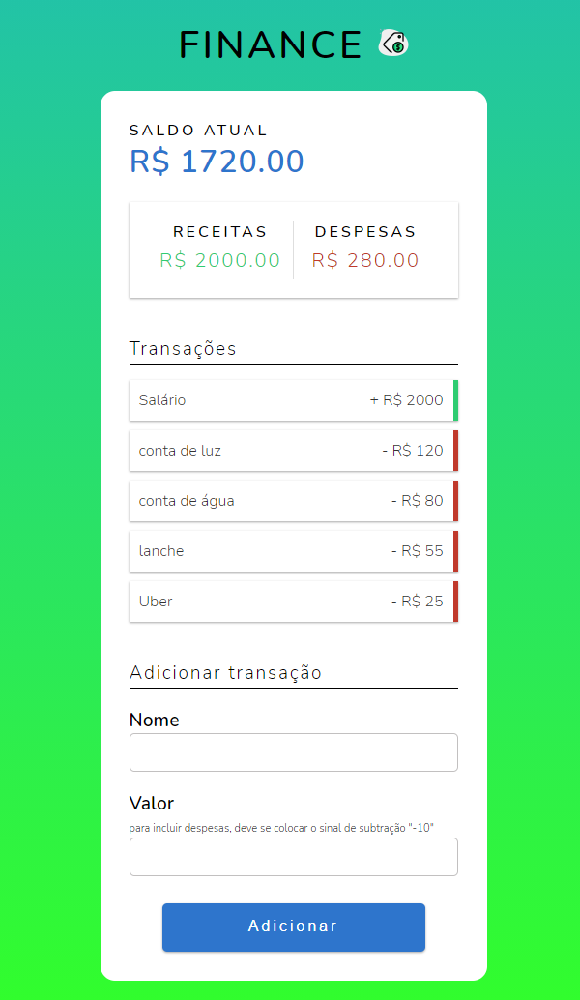

<h1 align="center">FINANCE </h1>

<h1>

</h1>
 <h3 align="center">
<a href="#" target="_blank" > 🚀 Acessar a demonstração da Finance</a></h3>

___

## 📖 ***Sobre***
O intuito do aplicativo é facilitar a organização de receitas e despesas financeiras, sendo assim, ajudando a saber com o que está gastando seu precioso dinheiro 🤑.
___

## 📌 Tecnologias utilizadas

O projeto foi desenvolvido utilizando as seguintes tecnolgias:
- HTML5
- CSS3
- JAVASCRIPT
___
💻 O projeto foi desenvolvido por Thiago Santos.